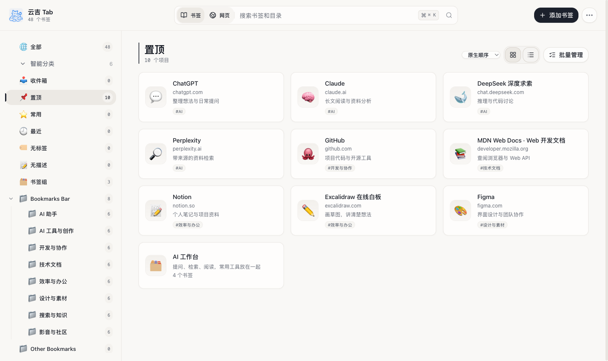
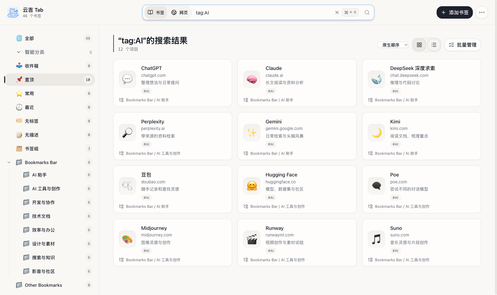
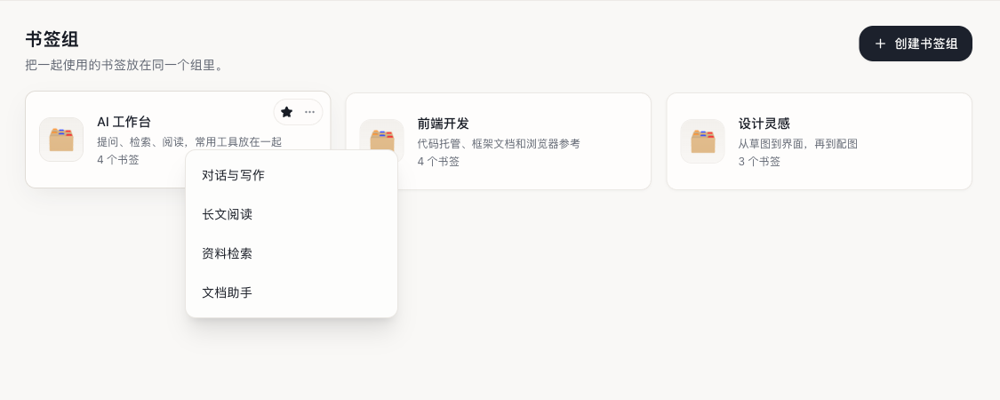
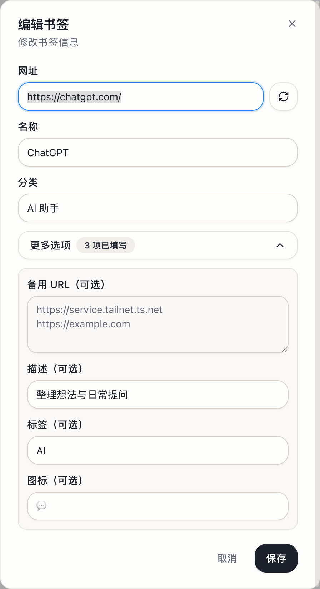
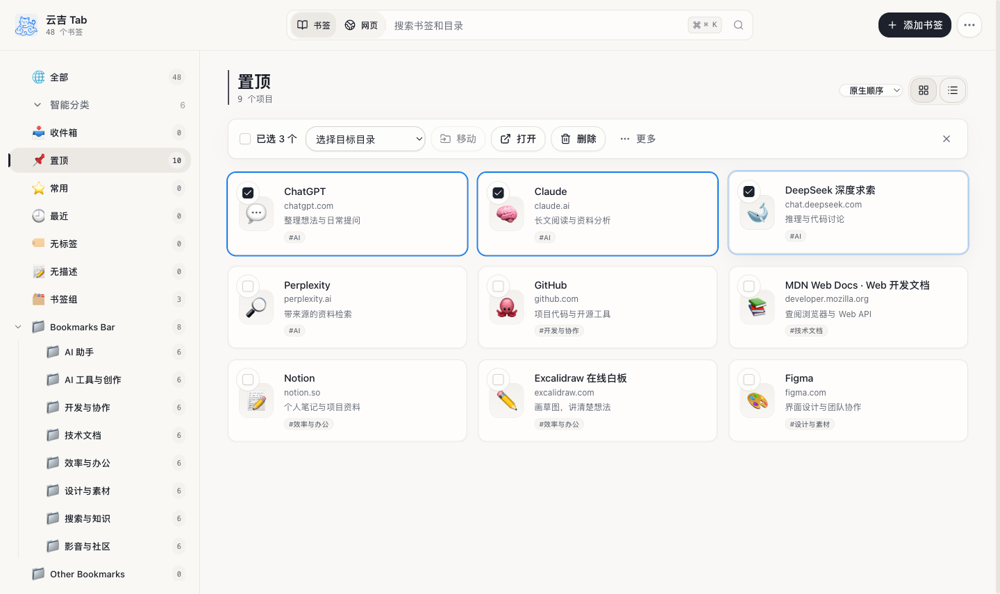
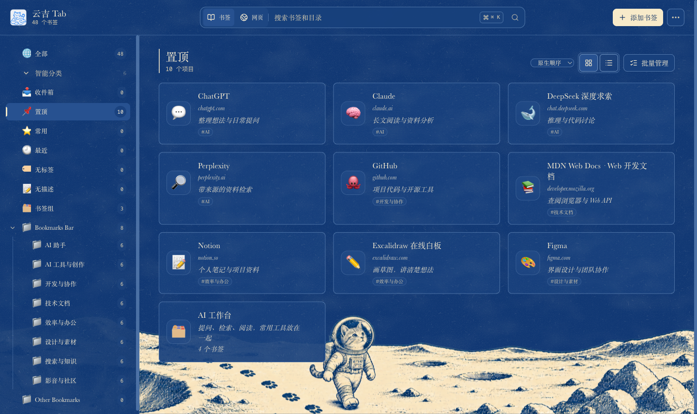
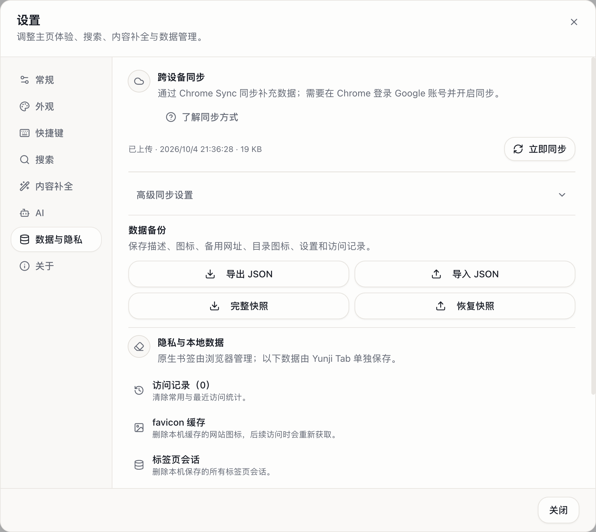

<p align="center">
  
</p>

# Yunji Tab · 云吉 Tab

把浏览器里已经收藏的网站，变成打开新标签页就能找到的书签主页。

云吉 Tab 是一个开源的 Chrome 扩展。它沿用浏览器原有的书签和文件夹，提供搜索、标签、书签组和批量整理，也可以换上喜欢的主题。安装后即可使用，无需迁移书签或注册额外账号。

[下载最新版本](https://github.com/kiwiflydream/yunji-tab/releases/latest) · [更新记录](https://github.com/kiwiflydream/yunji-tab/releases) · [反馈问题](https://github.com/kiwiflydream/yunji-tab/issues) · [开发指南](./docs/development.md)



## 安装

目前通过 GitHub Releases 提供 Chrome 安装包。

1. 打开[下载页面](https://github.com/kiwiflydream/yunji-tab/releases/latest)，下载名称为 `yunji-tab-<版本号>-chrome.zip` 的附件。页面自动生成的 `Source code` 是源码，不是安装包。
2. 解压 ZIP，确认目录内包含 `manifest.json`。
3. 在 Chrome 中打开 `chrome://extensions`，开启右上角的「开发者模式」。
4. 点击「加载已解压的扩展程序」，选择刚才解压的目录。
5. 打开一个新标签页，开始使用。

升级时，用新版本文件替换原安装目录的内容，再到扩展管理页点击重新加载。保留安装目录，不必卸载扩展。

项目主要支持 Chrome。Edge、Brave 和 Opera 等 Chromium 浏览器可以尝试加载同一安装包，目前未逐一验证兼容性。Firefox 和 Safari 暂未提供正式安装包。

## 日常使用

### 快速找到收藏的网站

左侧分类沿用原有书签文件夹。常用网站可以置顶，也可以从「最近」「无标签」「无描述」等智能分类中继续整理。

顶部搜索框可以直接查找书签和目录，也支持 `tag:AI`、`site:github.com`、`folder:技术文档` 这样的筛选。切换到「网页」后，可以使用浏览器默认搜索引擎，或选择其他引擎。



### 把一起使用的网站放进书签组

例如，把提问、阅读和检索工具放进一个「AI 工作台」。在「书签组」中点击「创建书签组」，填写标题和描述，从已保存的书签中选择成员；每个成员都能设置组内名称，还可以调整顺序和自定义组图标。

鼠标停留在组卡片上，或直接点击卡片，就会在当前页面展开名称列表，选择一个即可打开。书签组可以和普通书签一起置顶，不会改变成员原来的文件夹。删除组也不会删除原书签。



书签组默认开启。不需要时，可在「设置 → 常规 → 书签组」中关闭，已有配置会保留。

### 给书签补上自己的说明

在卡片的「更多操作 → 编辑书签」中修改名称、网址和分类。展开「更多选项」，可以填写描述、标签、自定义图标，以及同一服务的备用 URL。图标支持 Emoji 或图片网址。

<p align="center">
  
</p>

### 用备用 URL 自动选择访问入口

同一个服务可能有多个访问地址，比如家里的 NAS 同时提供外网域名和内网域名。把它们保存在同一个书签中，点击时，云吉 Tab 会同时探测主网址和备用 URL，自动打开最先响应的地址，省去切换网络后手动选择入口的麻烦。

例如，将 `https://nas.example.com` 填为主网址，在「更多选项 → 备用 URL」中填写内网地址 `http://nas.home.arpa`，多个备用地址每行一个：

| 使用环境            | 打开效果                                   |
| ------------------- | ------------------------------------------ |
| 外出使用公网        | 内网地址无法访问时，自动打开响应的外网域名 |
| 回家接入局域网      | 内网地址响应更快时，自动打开内网域名       |
| 连接 VPN 或组网工具 | 私有网络地址恢复可达后，也会参与自动选址   |

这也适合公司系统的内外网入口、自建服务的公网与 VPN 地址，或同一服务的多个等效访问入口。只需保存一个书签，就能随当前网络的访问情况选择地址。

选择依据是地址探测的响应速度。若所有地址都未探测成功，会回退打开主网址。

### 一次整理多个书签

点击「批量管理」，勾选书签后，可以一起移动、打开或删除，也可以拖动书签调整位置。

书签组也支持拖动卡片或拖拽柄调整顺序；在「置顶」中，书签组与普通书签可以混合排序。手动顺序会保存、参与浏览器同步，并包含在数据备份中。

删除后可以立即撤销；「更多操作 → 垃圾桶与历史」会保留最近 30 天的删除快照。整理较多收藏时，还可以使用「书签健康检查」查找重复、失效和重定向链接。



### 换一个喜欢的主页风格

在「设置 → 外观」中选择简洁、平衡、紧凑、柔和、纸墨或蓝墨版画。分类栏可以放在左侧或顶部，书签也可以切换为紧凑视图。

蓝墨版画采用深蓝与奶油白、衬线字体和印刷颗粒纹理，搭配项目原创的猫咪宇航员插画。插画固定在视窗底部，滚动书签时也能看到。



### 备份与恢复

打开「设置 → 数据与隐私」，可以导出、导入书签的补充数据，也可以用「完整快照」备份书签树及相关配置。导入前会显示预览；完整快照会恢复到一个新文件夹中，保留现有书签。



### 更多整理工具

- **AI 分类**：在「设置 → AI」中配置自己的服务，让 AI 帮忙生成书签分类方案。先查看移动预览，确认后再应用。
- **标签页会话**：从主页「更多操作」打开会话管理，保存一组打开的标签页，方便稍后恢复。

## 跨设备同步与隐私

原生书签由浏览器负责同步；云吉 Tab 默认同步描述、标签、图标、备用 URL 等补充数据，书签组也支持跨设备同步。两台设备需使用同一 Chrome 账号、开启浏览器同步，并安装云吉 Tab。

可以在「设置 → 数据与隐私」查看同步状态、选择同步字段或启用补充数据的口令加密。**书签组通过独立的浏览器同步存储保存，不受这项口令加密保护。**

云吉 Tab 不收集分析数据。获取网站图标时会向 Google Favicon 服务发送网站域名。AI 分类是可选功能，需要自行配置 OpenAI 兼容服务；分类方案会先预览，确认后才应用，API Token 不参与同步或备份。数据存放位置、对外请求和权限用途见[隐私与权限说明](./docs/privacy.md)。

## 常用快捷键

| 快捷键                                            | 操作                   |
| ------------------------------------------------- | ---------------------- |
| `/`                                               | 聚焦搜索框             |
| `Cmd/Ctrl + K`                                    | 打开命令面板           |
| `N`                                               | 新增书签               |
| 方向键、`Enter`                                   | 选择并打开书签         |
| `Esc`                                             | 清空搜索或关闭当前弹层 |
| `Alt + Shift + B`（macOS：`Command + Shift + B`） | 快速收藏当前网页       |

主页快捷键可在「设置 → 快捷键」中修改。浏览器级快捷键在 `chrome://extensions/shortcuts` 中设置。

界面支持简体中文、繁体中文、英语、日语、韩语、西班牙语和法语。

## 开发与贡献

项目使用 Plasmo、React 和 TypeScript。准备 Node.js 22 或更高版本及 pnpm 10.34.4 后，可以从源码运行：

```bash
corepack enable
pnpm install --frozen-lockfile
pnpm dev
```

开发模式加载 `build/chrome-mv3-dev/`。构建、测试和代码目录说明见[开发指南](./docs/development.md)。

欢迎通过 [Issues](https://github.com/kiwiflydream/yunji-tab/issues) 提交问题和建议，也欢迎贡献代码。报告问题时，附上复现步骤、浏览器版本和截图，提交前隐藏私人网址与凭据。

## 许可证

[MIT](./LICENSE) © 2026 KIWI
